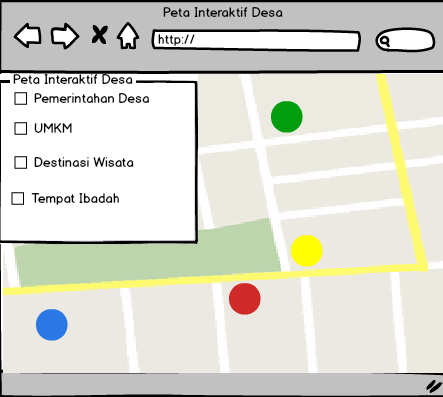

# Aplikasi Peta Interakif Desa

## Deskripsi Masalah
- Minimnya informasi mengenai lokasi fasilitas pemerintah yang ada di desa (contoh : kantor desa, rumah rw, rumah rt, dll)
- Kurangnya informasi penyebaran daerah dan batas wilayah program desa (contoh : kelompok tani, pkk, umkm, dll)

## Deskripsi Solusi
- Membuat peta interaktif desa yang memuat informasi yang ada di desa

## Use Case
- User petugas mampu input data kedalam basis data
- Aplikasi mampu menampilkan peta tematik berdasarkan kategori

## Struktur Data

### Desa
Nama Atribut | Tipe Data | Contoh
---|---|---
UUID | String | afd8fe00442d
Nama Desa | String | Desa Cibiuk Kaler
Area | Polygon | [107.9753615,-7.0485689,0],[107.9743316,-7.048143,0]],[107.9732158,-7.0499318,0]],[107.9714991,-7.050954,0]],[107.9697825,-7.0522317,0],[107.9699542,-7.0543612,0],[107.9687526,-7.0545316,0],[107.9671218,-7.0556389,0],[107.9642035,-7.0593017,0],[107.9623153,-7.060409,0],[107.9612853,-7.0616867,0],[107.9582812,-7.0624533,0],[107.9559638,-7.0627941,0],[107.9523589,-7.0643273,0],[107.9544188,-7.064668,0],[107.9563929,-7.0656901,0],[107.9568221,-7.0667123,0],[107.955363,-7.0693528,0],[107.9600837,-7.070375,0],[107.9595687,-7.0725044,0],[107.9648901,-7.0734875,0],[107.9673792,-7.0731468,0],[107.9698683,-7.0727209,0],[107.9713274,-7.0760428,0],[107.973044,-7.0785981,0]],[107.9759623,-7.0784277,0],[107.9772497,-7.0764687,]0,[107.980168,-7.076128,0],[107.9809404,-7.0745096,0],[107.9819704,-7.0734875,0],[107.9809404,-7.0727209,0],[107.9810263,-7.0717839,0],[107.9818846,-7.0715284,0],[107.9816271,-7.0700804,0],[107.9797388,-7.0699952,0],[107.9793955,-7.0680361,0],[107.9781939,-7.0673547,0],[107.9797388,-7.0670139,0],[107.9807688,-7.066077,0],[107.9797388,-7.0637771,0],[107.9787947,-7.0640327,0],[107.9782797,-7.0625846,0],[107.9766489,-7.0641179,0],[107.9758764,-7.0624995,0],[107.9769922,-7.0610514,0],[107.9762198,-7.0596033,0],[107.9763056,-7.0583256,0],[107.974074,-7.0586664,0],[107.9739882,-7.0561961,0],[107.9747606,-7.0539814,0],[107.9752756,-7.0532148,0],[107.9751898,-7.0503186,0],[107.9757906,-7.0496372,0],[107.9753615,-7.0480187,0]

### Fasilitas
Nama Atribut | Tipe Data | Contoh
---|---|---
UUID | String | e383ac8edd42
Nama Tempat | String | Kantor Desa
Kategori | String | db5f44edd5da (UUID Kategori)
Koordinat | Poin | [-7.068103962736509, 107.963188618302]
Area | Polygon | [[107.9631402,-7.0680404,0] [107.963112,-7.0682054,0], [107.9632106,-7.0682147,0], [107.9632341,-7.068053,0], [107.9631402,-7.0680404,0]

### Kategori
Nama Kategori | Tipe Data | Contoh
---|---|---
UUID | String | db5f44edd5da
Nama Kategori | String | Lembaga Pemerintah

### User
Nama Atribut | Tipe Data | Contoh
---|---|---
UUID | String | 121233hbrbfurfb
Username | String | RiloHusni
Password | Varcgar | @Terkadang66
Nama User | String | Rilo Husniyanwar
Foto | String | Rilo.png
Nomer Telepon | String | 087827665123
Email | String | husniyanwar@gmail.com
Role | Integer | 2
Koordinat | Point | [-7.10379, 107.98664]

### Role
Nama Atribut | Tipe Data | Contoh
---|---|---
Role ID | Integer | 2
Nama Role | String | User

## Mockup UX

